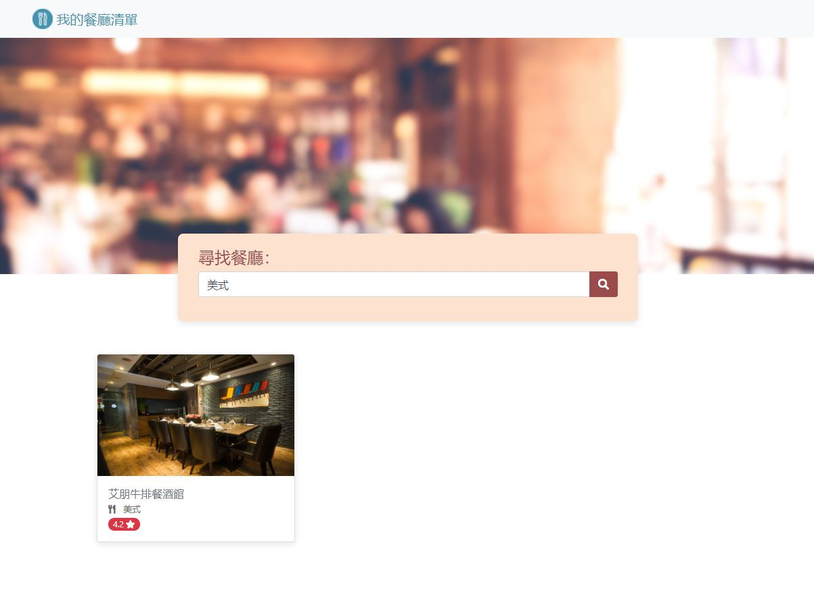

# 餐廳清單

餐廳清單主頁可看到所以餐廳列表，
提供查閱餐廳資訊與查詢餐廳功能。

## 產品功能

1、可查看所有餐廳列表，

2、點擊顯示餐廳詳細資訊，包含名稱、電話、地址與圖片等。

3、可查詢餐廳名稱，或者餐廳種類。

## 環境建置

- Visual Studio Code
- Node.js
- Express
- Express-Handlebars
- nodemon

## 安裝步驟

1、打開終端機(terminal)，Clone 此專案至本機電腦

2、進入本專案資料夾，指令"cd <資料夾名稱>"

3、安裝 npm，輸入 $ npm install

4、安裝 nodemon 套件，輸入 $ npm install -g nodemon

5、安裝模板引擎，輸入 $ npm i express-handlebars

6、執行檔案 $ npm run dev

7、終端機出現以下字樣"Express is listening on localhost: 3000."，代表成功

8、開啟瀏覽器，輸入 http://localhost:3000，開始使用

## 成品示意圖

